# MarkWrite Architecture

> **Version:** 1.0  
> **Last Updated:** 2026-04-04  
> **Status:** Production

This document provides a comprehensive overview of MarkWrite's system architecture, design decisions, and technical implementation details.

---

## Table of Contents

1. [Introduction](#1-introduction)
2. [System Context](#2-system-context)
3. [Container Architecture](#3-container-architecture)
4. [Component Architecture](#4-component-architecture)
5. [Data Architecture](#5-data-architecture)
6. [Real-time Collaboration Architecture](#6-real-time-collaboration-architecture)
7. [Security Architecture](#7-security-architecture)
8. [Deployment Architecture](#8-deployment-architecture)
9. [Technology Decisions](#9-technology-decisions)

---

## 1. Introduction

### 1.1 Purpose

MarkWrite is a professional, web-based Markdown editor that enables real-time collaboration without conflicts. This document describes the architectural decisions, system components, and their interactions that make this possible.

### 1.2 Architectural Goals

| Goal                        | Description                                                                                     |
| --------------------------- | ----------------------------------------------------------------------------------------------- |
| **Real-time Collaboration** | Multiple users must be able to edit the same document simultaneously with sub-second latency    |
| **Conflict-free Editing**   | Concurrent edits must merge automatically without data loss or manual resolution                |
| **Offline Support**         | Users should be able to continue editing when disconnected, with automatic sync on reconnection |
| **Scalability**             | The system must handle multiple concurrent editing sessions across many documents               |
| **Security**                | Document access must be strictly controlled with authentication and authorization               |
| **Maintainability**         | Clear separation of concerns with well-defined component boundaries                             |

### 1.3 Architectural Style

MarkWrite follows a **hybrid architecture** combining:

- **Monorepo Structure** - All applications and shared code in a single repository managed by Turborepo
- **Event-driven Real-time** - WebSocket-based communication for collaborative editing using CRDT
- **REST API** - Traditional HTTP endpoints for CRUD operations and authentication
- **Server-side Rendering** - SvelteKit for initial page loads with client-side hydration

---

## 2. System Context

The System Context diagram shows MarkWrite's position within the broader ecosystem and its interactions with external systems.

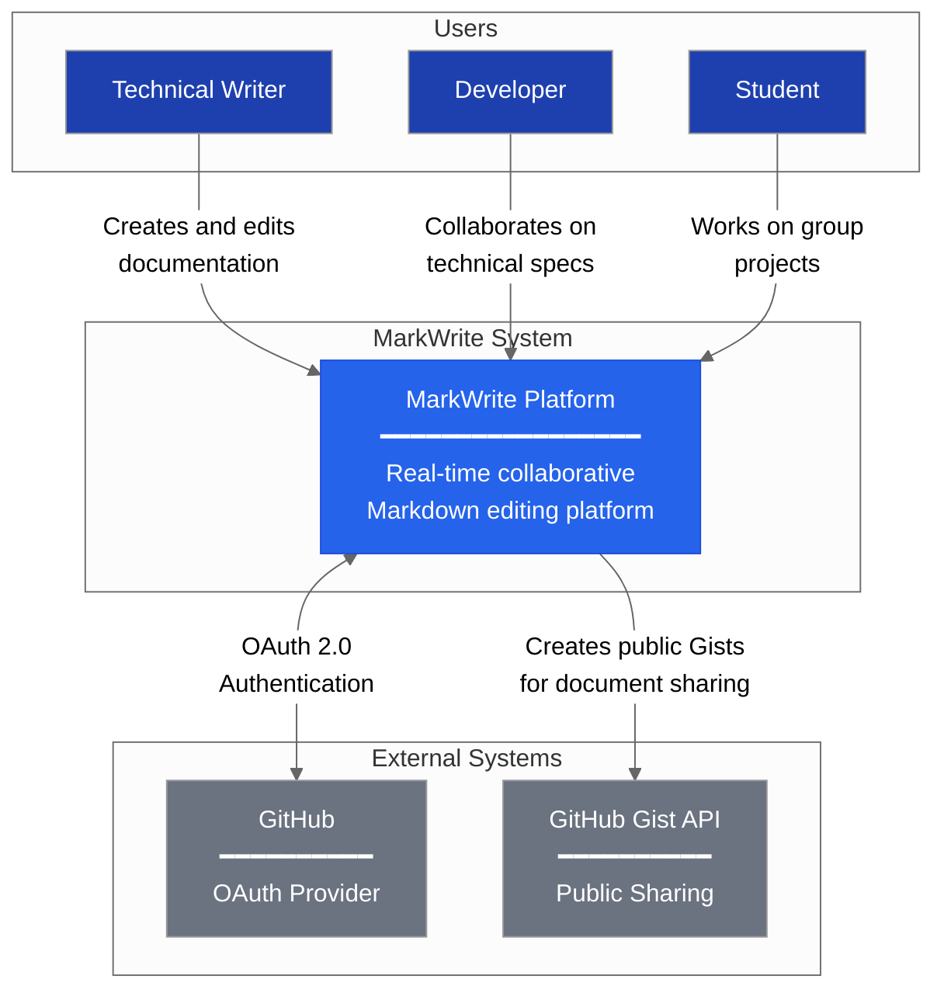

### 2.1 User Types

| User Type            | Primary Use Case                                      | Key Requirements                                        |
| -------------------- | ----------------------------------------------------- | ------------------------------------------------------- |
| **Technical Writer** | Documentation lead creating and maintaining team docs | Real-time collaboration, version history, clean exports |
| **Developer**        | Open source maintainer working on README and wikis    | GitHub integration, Markdown support, shareable links   |
| **Student**          | Group project documentation                           | Free access, simple sharing, no conflicts               |

### 2.2 External System Integrations

| System              | Integration Type | Purpose                                                                            |
| ------------------- | ---------------- | ---------------------------------------------------------------------------------- |
| **GitHub OAuth**    | Authentication   | Single sign-on using GitHub credentials, access to user profile (username, avatar) |
| **GitHub Gist API** | Data Export      | Create public Gists from documents for easy sharing outside the platform           |

---

## 3. Container Architecture

The Container diagram shows the high-level technical components that make up MarkWrite.

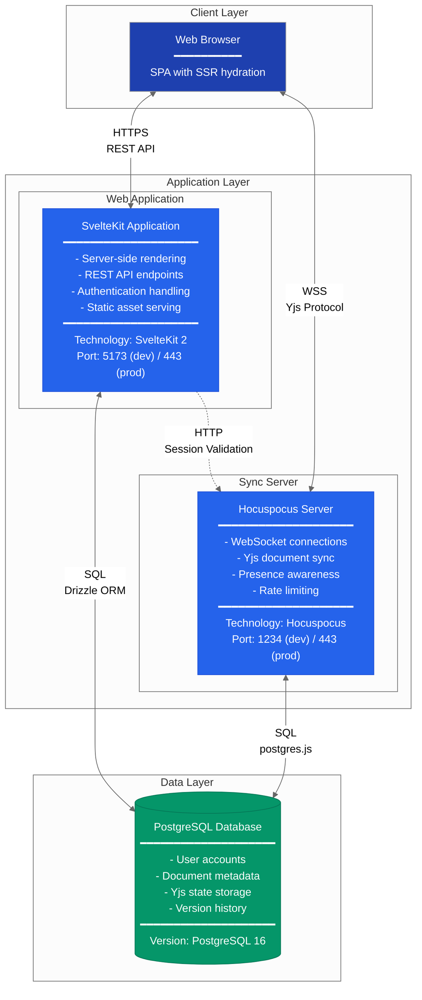

### 3.1 Web Application Container

The SvelteKit application serves as the primary interface for users and handles all non-real-time operations.

**Responsibilities:**

- Render the user interface (documents list, editor, settings)
- Handle user authentication via GitHub OAuth
- Provide REST API endpoints for document CRUD operations
- Manage user sessions and authorization
- Serve static assets (JavaScript, CSS, images)

**Technology Stack:**
| Component | Technology | Purpose |
|-----------|------------|---------|
| Framework | SvelteKit 2 | Full-stack web framework |
| Language | TypeScript 5 | Type-safe development |
| UI Library | shadcn-svelte | Accessible component library |
| Styling | Tailwind CSS 4 | Utility-first CSS |
| Database Access | Drizzle ORM | Type-safe SQL queries |
| Authentication | Lucia v3 | Session management |
| Validation | Zod | Runtime type validation |

### 3.2 Sync Server Container

The Hocuspocus server manages all real-time collaboration features using WebSocket connections.

**Responsibilities:**

- Maintain WebSocket connections with all active editors
- Synchronize Yjs document state between clients
- Broadcast presence information (cursors, selections)
- Persist document state to the database
- Enforce rate limits and connection policies

**Technology Stack:**
| Component | Technology | Purpose |
|-----------|------------|---------|
| Server | Hocuspocus | WebSocket server for Yjs |
| Runtime | Node.js 20 | Server runtime |
| Database | postgres.js | Direct PostgreSQL access |
| CRDT | Yjs | Conflict-free data types |

### 3.3 Database Container

PostgreSQL serves as the single source of truth for all persistent data.

**Stored Data:**

- User accounts and profiles
- Session tokens
- Document metadata and Yjs binary state
- Sharing permissions and collaborator lists
- Version history snapshots
- User preferences and settings

---

## 4. Component Architecture

### 4.1 Web Application Components

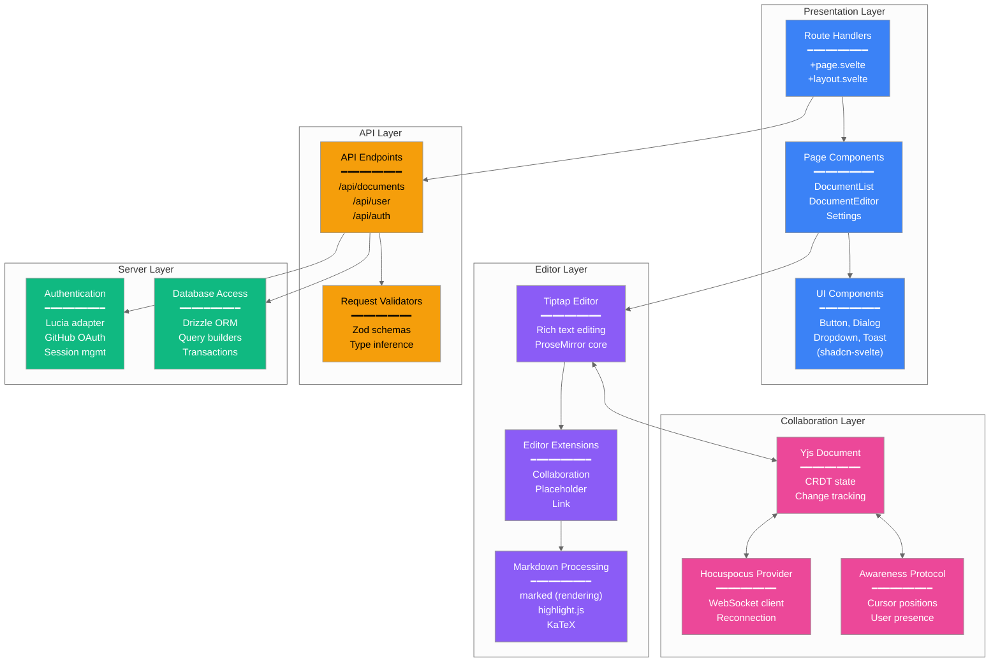

#### 4.1.1 Presentation Layer

The presentation layer handles all user interface concerns using Svelte 5's reactive paradigm.

| Component             | File Location                | Responsibility                                 |
| --------------------- | ---------------------------- | ---------------------------------------------- |
| **Route Handlers**    | `src/routes/`                | SvelteKit routing and page composition         |
| **Page Components**   | `src/routes/**/+page.svelte` | Full page layouts for each route               |
| **UI Components**     | `src/lib/components/ui/`     | Reusable interface elements from shadcn-svelte |
| **Layout Components** | `src/lib/components/layout/` | Navigation, headers, sidebars                  |

#### 4.1.2 Editor Layer

The editor layer provides rich Markdown editing capabilities built on Tiptap (ProseMirror).

| Component                   | Purpose                                                             |
| --------------------------- | ------------------------------------------------------------------- |
| **Tiptap Editor**           | Core rich-text editing engine with real-time collaboration support  |
| **Collaboration Extension** | Integrates Yjs for multi-user editing                               |
| **Cursor Extension**        | Displays remote user cursors with name labels                       |
| **Markdown Rendering**      | Converts Markdown to HTML with syntax highlighting and math support |

#### 4.1.3 Collaboration Layer

The collaboration layer manages all real-time synchronization using Yjs CRDTs.

| Component               | Purpose                                                                           |
| ----------------------- | --------------------------------------------------------------------------------- |
| **Yjs Document**        | In-memory CRDT document that tracks all changes                                   |
| **Hocuspocus Provider** | WebSocket client managing server connection, reconnection, and sync               |
| **Awareness Protocol**  | Broadcasts and receives user presence (cursor position, selection, online status) |

#### 4.1.4 API Layer

The API layer provides RESTful endpoints for all CRUD operations.

| Endpoint Group    | Base Path                           | Operations                             |
| ----------------- | ----------------------------------- | -------------------------------------- |
| **Documents**     | `/api/documents`                    | Create, read, update, delete documents |
| **Sharing**       | `/api/documents/[id]/share`         | Generate/revoke share tokens           |
| **Collaborators** | `/api/documents/[id]/collaborators` | Manage document permissions            |
| **Versions**      | `/api/documents/[id]/versions`      | Version history operations             |
| **User**          | `/api/user`                         | User profile and settings              |
| **Auth**          | `/api/auth`                         | Session validation                     |

#### 4.1.5 Server Layer

The server layer handles authentication and database operations.

| Component       | Purpose                                                     |
| --------------- | ----------------------------------------------------------- |
| **Lucia Auth**  | Session-based authentication with GitHub OAuth provider     |
| **Drizzle ORM** | Type-safe database queries with automatic migration support |

### 4.2 Sync Server Components

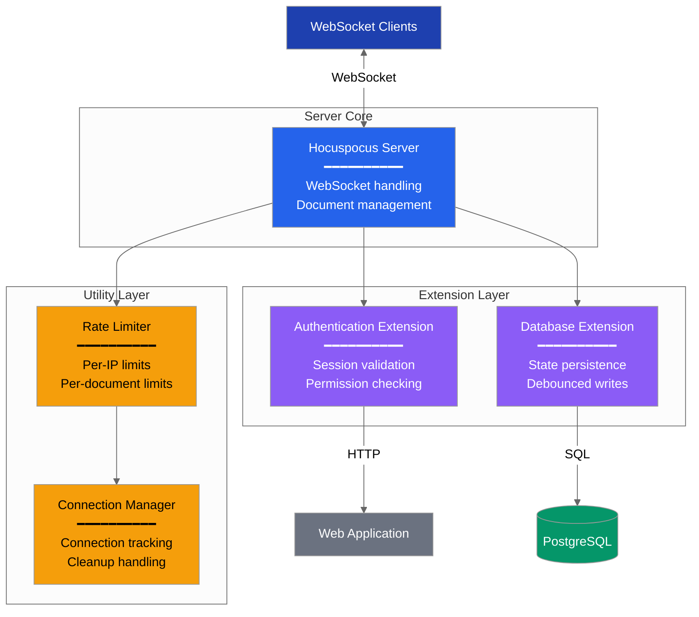

#### 4.2.1 Extension Details

| Extension                | Configuration                                                              | Behavior                                                          |
| ------------------------ | -------------------------------------------------------------------------- | ----------------------------------------------------------------- |
| **Authentication**       | Validates session cookie via web app `/api/documents/[id]/access` endpoint | Rejects connections without valid session or document permission  |
| **Database Persistence** | Debounce: 2-10 seconds                                                     | Stores Yjs binary state as base64 in `documents.yjs_state` column |
| **Rate Limiting**        | 10 connections/IP, 50 connections/document                                 | Prevents abuse and ensures fair resource allocation               |

---

## 5. Data Architecture

### 5.1 Entity Relationship Diagram

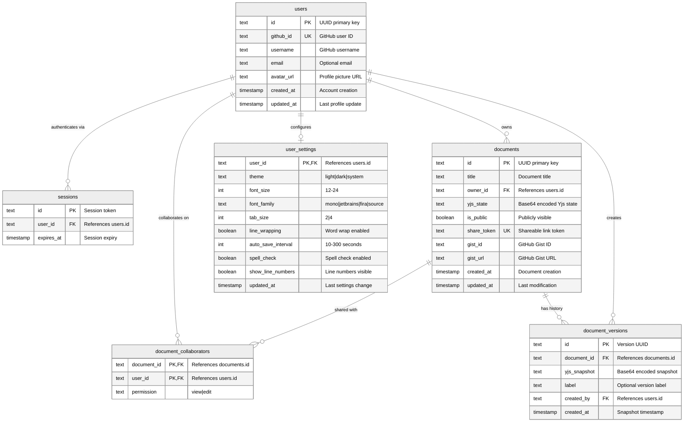

### 5.2 Table Descriptions

| Table                      | Purpose                                         | Key Relationships                                                       |
| -------------------------- | ----------------------------------------------- | ----------------------------------------------------------------------- |
| **users**                  | Stores user accounts created via GitHub OAuth   | One-to-many with documents, sessions, settings                          |
| **sessions**               | Active authentication sessions managed by Lucia | Many-to-one with users                                                  |
| **user_settings**          | Editor preferences per user                     | One-to-one with users                                                   |
| **documents**              | Document metadata and Yjs binary state          | Many-to-one with users (owner), one-to-many with collaborators/versions |
| **document_collaborators** | Sharing permissions for each document           | Junction table between documents and users                              |
| **document_versions**      | Historical snapshots for version history        | Many-to-one with documents and users                                    |

### 5.3 Yjs State Storage

The document content is stored as a serialized Yjs document in the `yjs_state` column:

1. **Encoding**: Yjs `encodeStateAsUpdate()` produces a `Uint8Array`
2. **Storage**: The binary is base64-encoded and stored as text
3. **Retrieval**: On load, the base64 is decoded and applied via `applyUpdate()`
4. **Size**: Typical documents are 1-100KB; maximum supported is 10MB

---

## 6. Real-time Collaboration Architecture

### 6.1 CRDT-based Synchronization

MarkWrite uses **Yjs**, a high-performance CRDT implementation, to enable conflict-free collaborative editing.

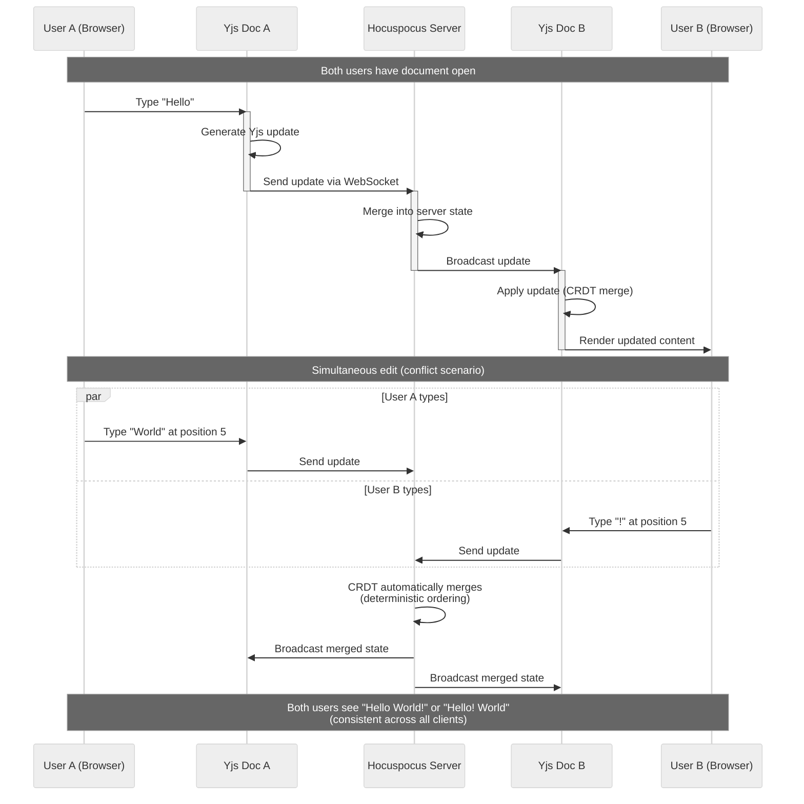

### 6.2 Why CRDT?

| Challenge            | Traditional Approach              | CRDT Approach                               |
| -------------------- | --------------------------------- | ------------------------------------------- |
| **Concurrent edits** | Lock document or manual merge     | Automatic merge with guaranteed consistency |
| **Network latency**  | Delayed sync, potential conflicts | Local-first, sync when possible             |
| **Offline editing**  | Disabled or queued                | Full editing, merge on reconnect            |
| **Consistency**      | Eventual (may diverge)            | Strong eventual consistency guaranteed      |

### 6.3 Presence Awareness

The awareness protocol broadcasts user state to all connected clients:

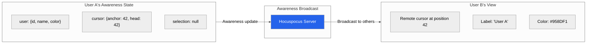

**Awareness Data Structure:**

```typescript
interface UserPresence {
  id: string; // User ID
  name: string; // Display name
  color: string; // Cursor color (deterministic from ID)
  avatar?: string; // Avatar URL
}

interface CursorState {
  user: UserPresence;
  anchor: number; // Selection start
  head: number; // Selection end (cursor position)
}
```

### 6.4 Persistence Strategy

Document state is persisted using a debounced write strategy:

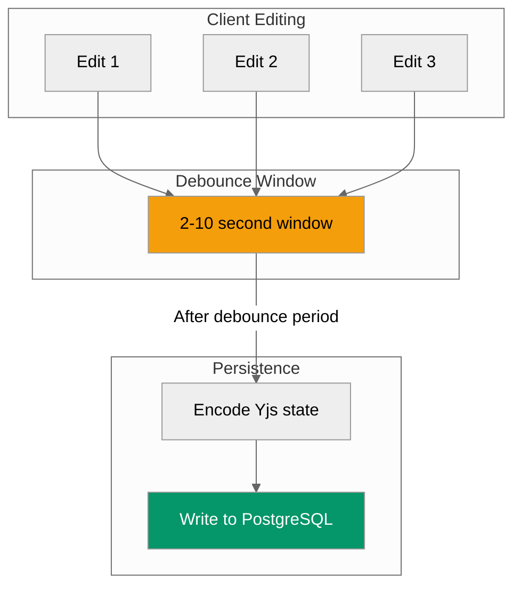

**Configuration:**
| Parameter | Value | Purpose |
|-----------|-------|---------|
| `DEBOUNCE_MS` | 2000ms | Minimum time before persisting |
| `MAX_DEBOUNCE_MS` | 10000ms | Maximum time before forcing persist |

---

## 7. Security Architecture

### 7.1 Authentication Flow

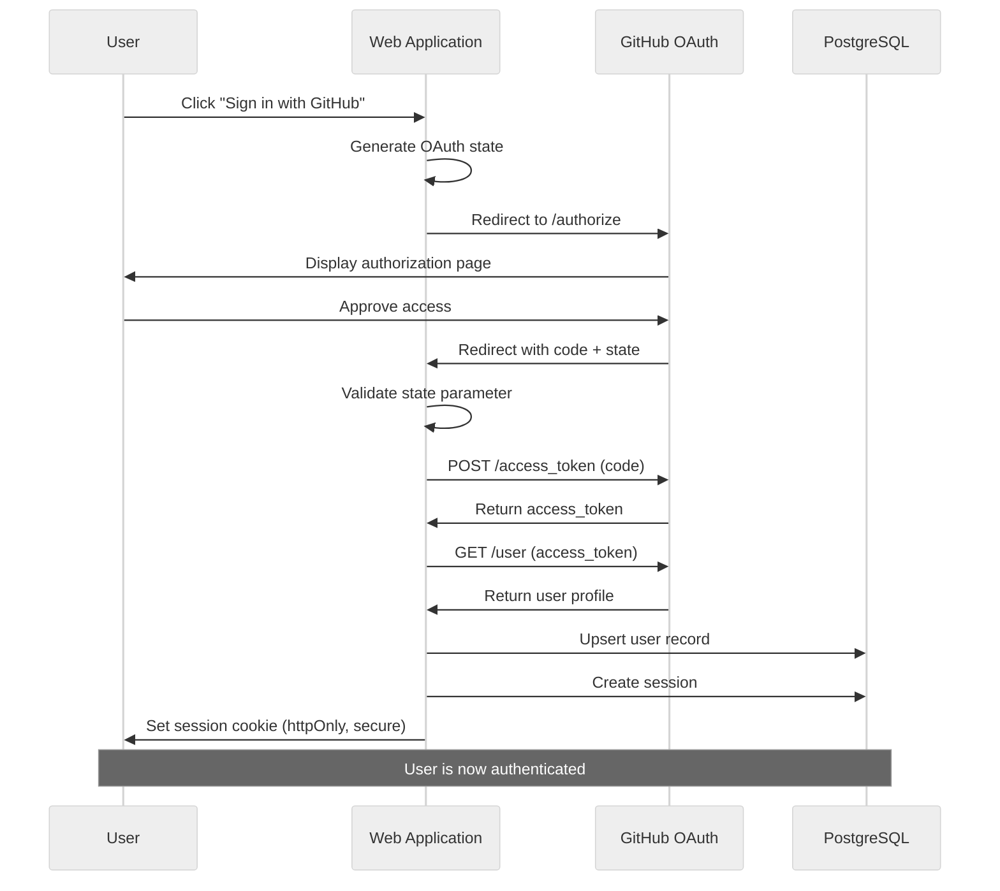

### 7.2 Authorization Model

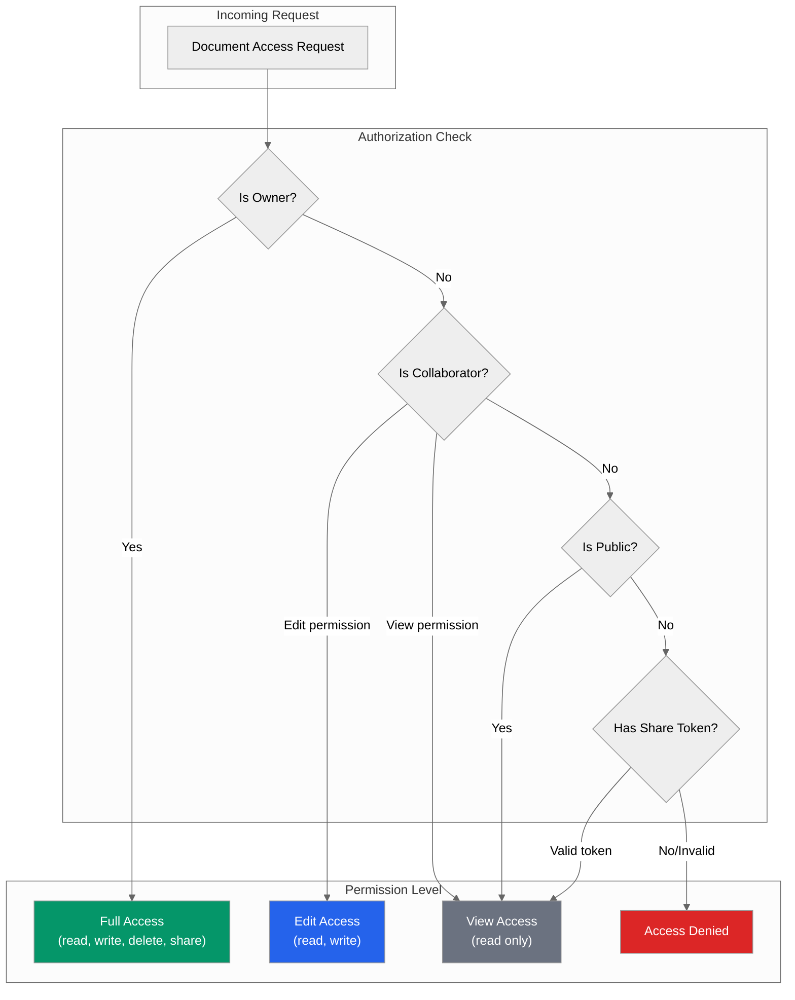

### 7.3 Security Measures

| Layer                | Measure              | Implementation                          |
| -------------------- | -------------------- | --------------------------------------- |
| **Transport**        | TLS encryption       | HTTPS for web, WSS for WebSocket        |
| **Authentication**   | Session-based auth   | Lucia with httpOnly, secure cookies     |
| **Authorization**    | Permission checks    | Server-side validation on every request |
| **Rate Limiting**    | Connection limits    | 10/IP, 50/document on sync server       |
| **Input Validation** | Schema validation    | Zod schemas on all API endpoints        |
| **XSS Prevention**   | Content sanitization | DOMPurify for rendered Markdown         |
| **CSRF Protection**  | SameSite cookies     | Strict cookie policy                    |

---

## 8. Deployment Architecture

### 8.1 Production Topology

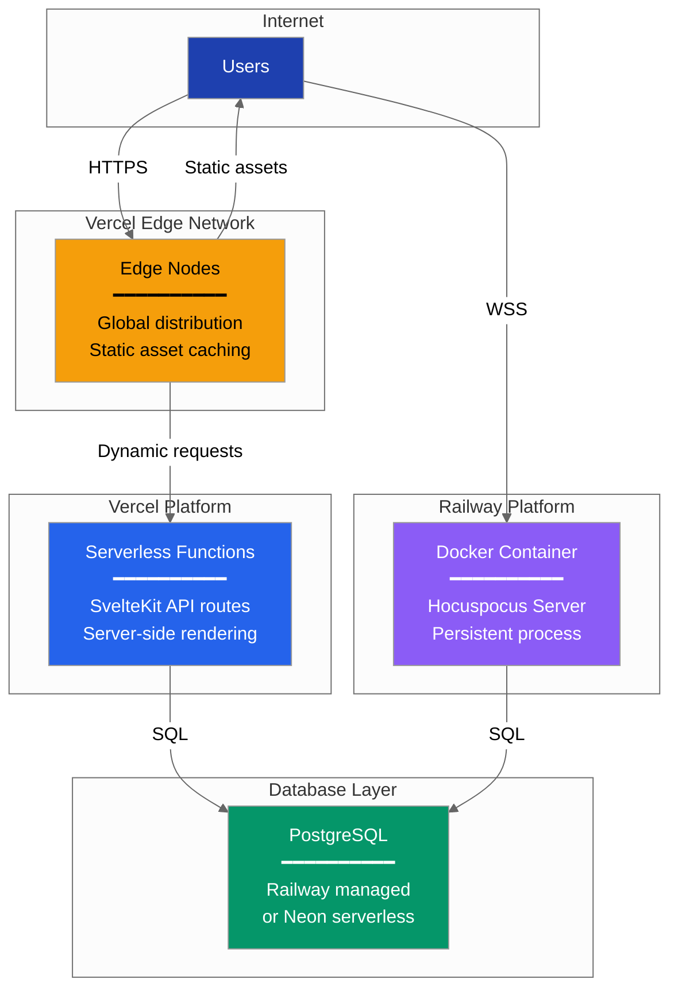

### 8.2 Deployment Targets

| Component           | Platform        | Reason                                                        |
| ------------------- | --------------- | ------------------------------------------------------------- |
| **Web Application** | Vercel          | Optimized for SvelteKit, global edge network, automatic HTTPS |
| **Sync Server**     | Railway         | Supports persistent WebSocket connections, Docker containers  |
| **Database**        | Railway or Neon | Managed PostgreSQL with connection pooling                    |

### 8.3 Scaling Considerations

| Component           | Scaling Strategy                                                             |
| ------------------- | ---------------------------------------------------------------------------- |
| **Web Application** | Horizontal (Vercel automatically scales serverless functions)                |
| **Sync Server**     | Vertical (single instance per deployment); horizontal requires Redis adapter |
| **Database**        | Vertical (managed scaling) with connection pooling                           |

---

## 9. Technology Decisions

### 9.1 Decision Records

#### 9.1.1 Yjs for CRDT

| Aspect         | Decision                                                                        |
| -------------- | ------------------------------------------------------------------------------- |
| **Choice**     | Yjs over Automerge, ShareDB                                                     |
| **Rationale**  | Best performance benchmarks, mature ProseMirror integration, active maintenance |
| **Trade-offs** | Binary protocol (harder to debug), requires specialized server                  |

#### 9.1.2 Hocuspocus for WebSocket

| Aspect         | Decision                                                                     |
| -------------- | ---------------------------------------------------------------------------- |
| **Choice**     | Hocuspocus over custom WebSocket server                                      |
| **Rationale**  | Purpose-built for Yjs, built-in persistence extensions, authentication hooks |
| **Trade-offs** | Less flexibility than custom server, tied to Tiptap ecosystem                |

#### 9.1.3 SvelteKit for Frontend

| Aspect         | Decision                                                                      |
| -------------- | ----------------------------------------------------------------------------- |
| **Choice**     | SvelteKit over Next.js, Remix                                                 |
| **Rationale**  | Excellent DX, smaller bundle size, native TypeScript support, unified routing |
| **Trade-offs** | Smaller ecosystem than React, fewer component libraries                       |

#### 9.1.4 Drizzle for ORM

| Aspect         | Decision                                                                |
| -------------- | ----------------------------------------------------------------------- |
| **Choice**     | Drizzle over Prisma, TypeORM                                            |
| **Rationale**  | Full TypeScript inference, minimal runtime overhead, SQL-like query API |
| **Trade-offs** | Newer project, fewer migration features than Prisma                     |

#### 9.1.5 Lucia for Authentication

| Aspect         | Decision                                                               |
| -------------- | ---------------------------------------------------------------------- |
| **Choice**     | Lucia over Auth.js, custom JWT                                         |
| **Rationale**  | Lightweight, session-based (better for SSR), excellent Drizzle adapter |
| **Trade-offs** | Less feature-rich than Auth.js, manual OAuth setup                     |

---

## References

- [C4 Model](https://c4model.com/) - Architecture visualization methodology
- [Yjs Documentation](https://docs.yjs.dev/) - CRDT implementation
- [Hocuspocus Documentation](https://tiptap.dev/hocuspocus) - WebSocket server
- [SvelteKit Documentation](https://kit.svelte.dev/) - Web framework
- [Drizzle ORM Documentation](https://orm.drizzle.team/) - Database ORM
- [Lucia Documentation](https://lucia-auth.com/) - Authentication library
